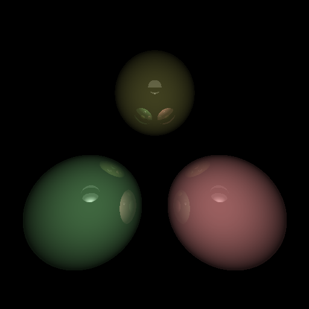
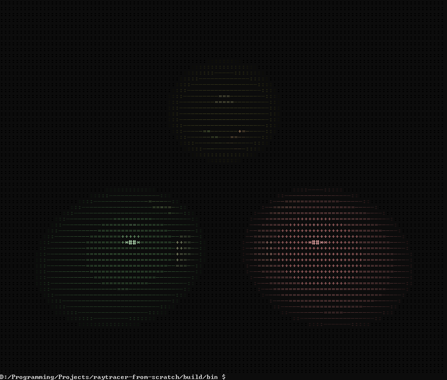

# raytracer-from-scratch

A raytracer which uses left-hand coordinate system and in which camera looks in `+Z` direction by default. Supports normal (pixel-based) and terminal-based rendering!





Features:
- Sphere primitive
- Variety of light sources (point, ambient, directional)
- Shininess
- Reflections

Visualization of the simple scene I made in GeoGebra: https://www.geogebra.org/calculator/zfexqajh

# Installation
```bash
git clone https://github.com/fahlerile/raytracer-from-scratch
cd raytracer-from-scratch
mkdir build
cd build
cmake ..
make
cd bin
./raytracer
```

# Use

## CLI options
- `--terminal-rendering` - render in terminal using colored ASCII
- `--save` - save rendered image to .BMP, or to .ANS if --terminal-rendering (open .ANS with cat tool)
- `--save-filename={FILENAME}` - file to save rendered image to (works only if --save is enabled)
- `--help` - show help message

## Scene configuration

To configure your scene, you should change `scene.json` in `bin/` directory. All available primitives and light sources are listed in [`Object`](Object/) and [`Light`](Light/) header files. In your JSON file you should put the same arguments as requested in these primitives/light sources constructors.

## Example:

From [`Light/DirectionalLight/DirectionalLight.hpp`](Light/DirectionalLight/DirectionalLight.hpp)
```cpp
DirectionalLight(double intensity, color_t color, vec3d direction);
```
That means if you want your directional light to be white, 100% intense and to "look" in +Z direction, you should put this in your scene file (to be more precise, in `light_sources` section):
```json
{
    "type": "DirectionalLight",
    "intensity": 1,
    "color": [255, 255, 255, 255],
    "direction": [0, 0, 1]
}
```

## TODO/NOTES
New features:
- [ ] Add other primitives
    - [x] Sphere
    - [x] Plane
        - [x] Change parser to accept new `Plane` constructor
        - [x] Edge case: ray has infinitely many points with plane
            - In this case formula divides by zero, no plane at all, nothing breaks
        - [x] Edge case: `pointN` all lie on one line / the same point
            - In this case there is no plane at all, nothing breaks
    - [x] Polygon (convex n-gon)
        - [x] Change parser to accept `Polygon`
        - [ ] разобраться с поворотами (по часовой, против часовой)
        - [ ] Edge case: points all lie on one line / the same point
        - [ ] Edge case: points does not lie on one plane
        - [ ] Check for overlapping (multiple polygons share vertices)
    - [ ] Parallelepiped (wrapper for `Polygon`)
    - [ ] Cylinder
    - [ ] Tube
    - [ ] Torus
    - [ ] Cone
- [ ] Make `Polygon` "independent" from `Triangle`, delete `Triangle`
- [ ] Light depends on orientation of triangle/plane
- [ ] Add `cerr` warnings for edge cases
- [ ] Fix light bugs
    - [ ] `AmbientLight::intensity` is being implicitly upscaled to `0.2` in `Scene::calculate_color`
    - [ ] Search for other bugs
- [ ] Make `scene.json` parser better
- [ ] Camera transform (camera matrix)
- [ ] Camera configuration in `scene.json`
- [ ] Textures
- [ ] Real-time rendering, camera movement

Potential bug causes:
- [ ] `alpha` parameter is changing during `color_t` arithmetic (should it?)
